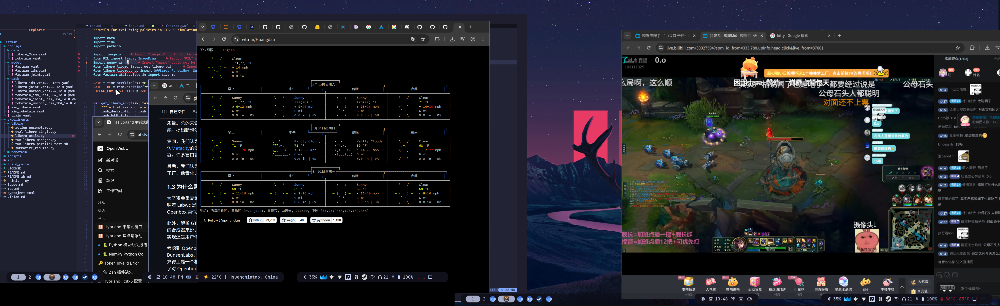

+++
date = '2026-05-30'
title = 'linux窗口合成器评测'
tags = ['linux']
+++

## hyprland

平铺式

有hyde，开箱即用的桌面环境（整合包）

颜值很高

不过个人不喜欢平铺式

可以设置所有窗口为浮动，勉强能当堆叠式用，但是终究不是堆叠式，这么用有bug

使用hyde

主题Catppuccin Mocha

waybar使用layout 16

## labcw

